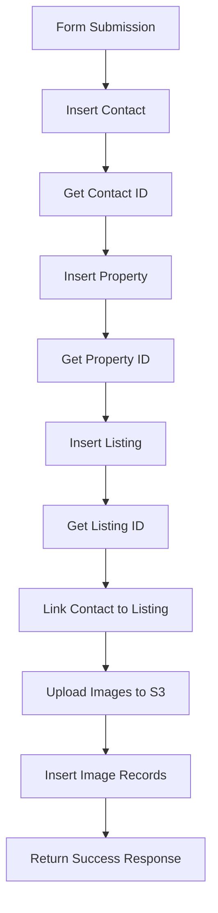

# Venta Process - Database Queries Summary

This document outlines each database query executed when a user submits the venta (sale) form in the property listing process.

## Overview
The venta process involves **8 different database operations** executed sequentially to create a complete property listing with all associated data.

## Query Breakdown

### 1. Insert Contact Information
**Location**: `src/server/actions/property-listing.ts:77-84`
**Table**: `contacts`
**Purpose**: Creates a new contact record for the property owner

```sql
INSERT INTO contacts (
    accountId,
    firstName,
    lastName, 
    email,
    phone,
    isActive
) VALUES (...)
```

**Data Source**: Form's "Datos de Contacto" step
- `firstName` ← `formData.contactInfo.nombre`
- `lastName` ← `formData.contactInfo.apellidos`
- `email` ← `formData.contactInfo.email`
- `phone` ← `formData.contactInfo.telefono`
- `isActive` ← `2` (hardcoded)

---

### 2. Retrieve Inserted Contact
**Location**: `src/server/actions/property-listing.ts:87-92`
**Table**: `contacts`
**Purpose**: Gets the auto-generated `contactId` from the newly created contact

```sql
SELECT * FROM contacts 
WHERE accountId = ? 
ORDER BY createdAt DESC 
LIMIT 1
```

**Result**: Returns `contactId` needed for linking to listing

---

### 3. Insert Property Information
**Location**: `src/server/actions/property-listing.ts:101-146`
**Table**: `properties`
**Purpose**: Creates the main property record with all physical characteristics

```sql
INSERT INTO properties (
    accountId,
    referenceNumber,
    title,
    propertyType,
    bedrooms,
    bathrooms,
    squareMeter,
    street,
    addressDetails,
    postalCode,
    hasElevator,
    hasGarage,
    hasStorageRoom,
    pool,
    garden,
    balconyCount,
    terrace,
    airConditioningType,
    hasHeating,
    securityGuard,
    builtInWardrobes,
    seaViews,
    mountainViews
) VALUES (...)
```

**Data Sources**:
- **Property Info**: `formData.propertyInfo` (type, rooms, bathrooms, surface, features)
- **Location Info**: `formData.locationInfo` (address, postal code, locality)
- **Features Mapping**: Converts `caracteristicas` array to individual boolean fields

---

### 4. Retrieve Inserted Property
**Location**: `src/server/actions/property-listing.ts:149-154`
**Table**: `properties`
**Purpose**: Gets the auto-generated `propertyId` from the newly created property

```sql
SELECT * FROM properties 
WHERE referenceNumber = ? 
LIMIT 1
```

**Result**: Returns `propertyId` needed for creating listing

---

### 5. Insert Listing Information
**Location**: `src/server/actions/property-listing.ts:174-191`
**Table**: `listings`
**Purpose**: Creates the listing record that defines this as a sale/rental with pricing

```sql
INSERT INTO listings (
    accountId,
    propertyId,
    agentId,
    listingType,
    price,
    status,
    isFurnished,
    optionalGarage,
    optionalStorageRoom,
    hasKeys,
    studentFriendly,
    petsAllowed,
    appliancesIncluded
) VALUES (...)
```

**Data Source**: Form's "Datos Económicos" step
- `listingType` ← "Sale" (for venta) or "Rent" (for alquiler)
- `price` ← `formData.economicInfo.precioVenta` or `formData.economicInfo.precioAlquiler`
- `status` ← "Draft"
- `isFurnished` ← Based on "Amueblado" in `caracteristicas`

---

### 6. Retrieve Inserted Listing
**Location**: `src/server/actions/property-listing.ts:193-199`
**Table**: `listings`
**Purpose**: Gets the auto-generated `listingId` from the newly created listing

```sql
SELECT * FROM listings 
WHERE propertyId = ? 
ORDER BY createdAt DESC 
LIMIT 1
```

**Result**: Returns `listingId` needed for linking contact to listing

---

### 7. Insert Listing Contact (Owner Relationship)
**Location**: `src/server/actions/property-listing.ts:207-211`
**Table**: `listing_contacts`
**Purpose**: Links the contact to the listing as the property owner

```sql
INSERT INTO listing_contacts (
    listingId,
    contactId,
    contactType
) VALUES (?, ?, 'owner')
```

**Purpose**: Establishes the relationship between the listing and the contact who owns the property

---

### 8. Upload Images and Insert Image Records
**Location**: `src/server/actions/property-listing.ts:214-236`
**Table**: `property_images`
**Purpose**: Uploads images to S3 and creates database records for each image

**For each image**:
1. **S3 Upload**: Uploads file to AWS S3 bucket
2. **Database Insert**: 
```sql
INSERT INTO property_images (
    propertyId,
    referenceNumber,
    imageUrl,
    imageKey,
    s3key,
    imageOrder,
    imageTag
) VALUES (...)
```

**Data Source**: Form's "Imágenes" step
- First image gets `imageTag: "main"`
- Subsequent images get `imageTag: "additional"`
- Images are ordered by upload sequence

---

## Process Flow Summary



## Key Points

- **Transaction Safety**: All operations are wrapped in a try-catch block
- **Auto-generated IDs**: The process retrieves auto-generated IDs after each insert to use in subsequent operations
- **Reference Number**: Generated as `VESTA-{8-character-nanoid}` for property tracking
- **Image Handling**: Only processes images if S3 configuration is available
- **Draft Status**: All listings start with "Draft" status
- **Owner Relationship**: Automatically creates an "owner" relationship between contact and listing

## Error Handling

The process includes validation at each step:
- Verifies contact insertion succeeded
- Verifies property insertion succeeded  
- Verifies listing insertion succeeded
- Logs image upload failures but continues processing
- Returns detailed error messages on failure